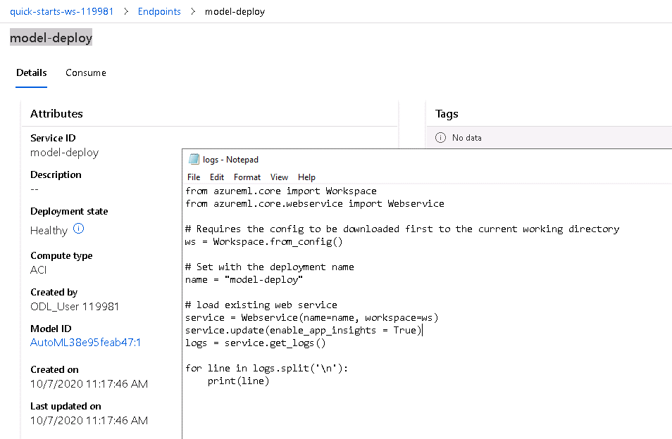
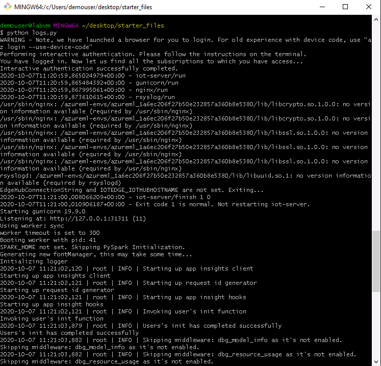
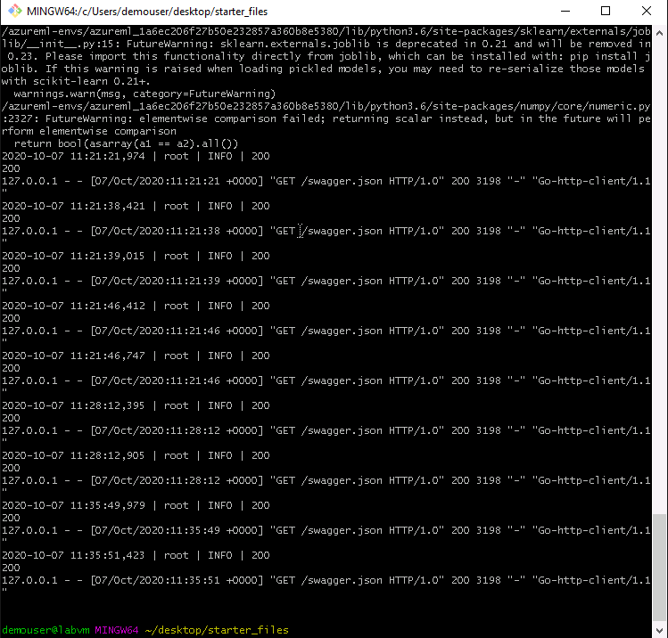

# Project overview – Operationalizing an Azure Pipeline

In this project, we are going to deploy a model which is trained using Automated ML and consume the Endpoint. The Project also involves automating the ML Model Pipeline. 

**This involves steps by step process such as ,**
-	Importing the dataset and registering it in Azure ML Studio
-	Setting up AutomatedML experiment run to identify the best model for the provided dataset and Machine Learning problem type. 
-	Best Model is identified and Deployed 
-	After deployment of the model, application insights in enabled using script . This is used to check the performance of the Deployed End point on handling request
-	Swagger Json file is used to Provide a POST request with features values on the SWAGGER instance in local host
-	This step is performed to check if the model can get POST request and respond back
-	Next step is to consume the model. A simulated check is performed using enpoint.py file to consume the features values in form of JSON and respond back
-	And finally An automated pipeline in enabled

**Following image depicts the high-level Architecture with Descriptions**

# Key Steps

## Step 1: Authentication

** Since the entire experiment was executed in Udacity Provided Azure Workspace , the authentication step is already part of the setup and no additional step is added** This is in accordance with the note in Project Guidelines

## Step 2 : Automated ML Experiment

As part of Automated ML Experiments , Following steps are performed

-	Dataset is imported and registered in AurzeML Studio
### Data

The dataset used in this Experiments is based on banking sector where details such as customer demographics, transactions are part of it. This is an ideal dataset for ML based classification problem where we are classifying the customers whether they will subscribe to term deposits. 
Source "https://automlsamplenotebookdata.blob.core.windows.net/automl-sample-notebook-data/bankmarketing_train.csv" 

  
-**After the dataset is registered, Automated ML sequence is created with objective type as “Classification” and provided with all required parameters.**

-	After completion of experiment, the status in the automated ML turns into Completed as shows below

-	Best model is identified from the experiments and will be used for Deployment

-	From the list , we can identify the top model is Voting Ensemble , which is selected to get a details about the model performance

 
 ## Step 3 : Deploy the Best Model

AS part of this steps, the best model is identified and deployed. Once the deployment status turns to healthy, more detail such as **REST API , keys , Swagger Json details ** will be displayed

### Image below shows the successful deployment of the model

### After the model deployment state changes to healthy, we can observe more details of the model is displayed

## Step 4: Enable Application Insights

-	After model is deployed , the next step is to enable the Application insights features for the model deployment. 
-	This is done by suing the script log.py. Configuration information are downloaded from the Azure in the form of **config.json** file

-	After downloading the config.json file , the details from it copy pasted into log.py file. And the API System.update is used to enable Application insights features

### Downloaded Config.json file

### Updates to the log.py file

### Execution of log.py file and output in Git Bash

### After running log_py.png from the VM , we can observe the Application insights is enabled in the Azure portal in deployed model endpoint page

### Application insights portal below

 
 

